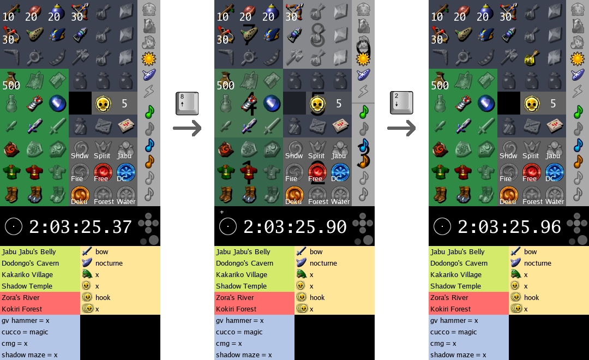

# Ivan
What's the opposite of a nagging fairy that always gets in your way and never
tells you anything useful? Ivan.

Ivan is a tailor-made, keyboard-driven _Ocarina of Time: Randomizer_ item
tracker, hint tracker, and timer. Because using a mouse is slow, and you
gotta go fast.

# Keyboard input

**Ivan must be focused for keyboard input to work.**

- `Esc` quits the tracker, only works when the timer is stopped (not paused) to
  avoid accidentally closing the tracker.
- `Home` resets the tracker and reloads its configuration from file, only works
  when the timer is stopped (not paused).
- `Del` to reset the timer and the tracker, only works when the timer is paused.
- `-` to undo the last action.
- `+` to redo the last undone action.

The state of the tracker is persisted to file in case you close it by mistake
of if someone played _Song of Storms_ nearby. `Del` will reset the tracker
right after launching if needed.

## Item tracker
Basic usage:
1. Press a number on your numpad to select an item zone
2. Press another number to select and upgrade/enable an item

_Item zones_ visually map to your numpad, ie. bottom-left is `1`, top-right is
`9`. same for items inside their own 3×3 grid.  
eg. if you wanted to enable _Light Arrows_, you would press `8` (top-middle)
then `2` (bottom-middle). That's it.

Songs are a special case as they are not selectable using their visible
position on the tracker, instead they are accessible in logical order (eg. to
get _Requiem_ you would press `3` as teleportation songs are in the bottom-right
zone, then `4` because _Requiem_ is the fourth song in the pause menu).

Other keys:
- `0` to display the region highlight or reset your selection.
- `.` to _downgrade_ the next selected item instead of upgrading it.

### Mouse
1. Left click to _upgrade_ an item.
2. Right click to _downgrade_ an item.
3. Scroll up/down to:
  - _upgrade_ or _downgrade_ an item.
  - cycle up/down the list of dungeons on stones and medallions.

## Timer
- `space` once to start the timer, then to pause/resume its _display_ (it still
  runs in the background).

## Hint tracker
1. Press the key corresponding to your hint type (WotH, Barren, Sometimes,
   Always)
2. Type your text.
3. Press `Enter`

- `w` to enter a _WotH_ Hint (green background, fuzzy location search)
- `b` to enter a _Barren_ Hint (red background, fuzzy location search)
- `s` to enter a _Sometimes_ Hint (blue background, freeform text)
- `a` to enter a _Always_ Hint (yellow background)
- `Esc` to cancel your input
- `Enter` to submit your input

As _Always Hints_ have a fixed slot, they get special treatment. The text you input
is parsed as the slot name until the first space, then your text. eg. If you
get _Nocturne of Shadows_ on _Ocarina of Time_ you might press `a` to start the
prompt then `oot = nocturne` then `Enter`.

## Customization
The images in the [`assets`](./assets) folder can be changed if you wish to
customize your background or your icons.  
The [`config.json`](./assets/config.json) file contains all positions and
definitions of the available items and locations, it also contains keybinds.
